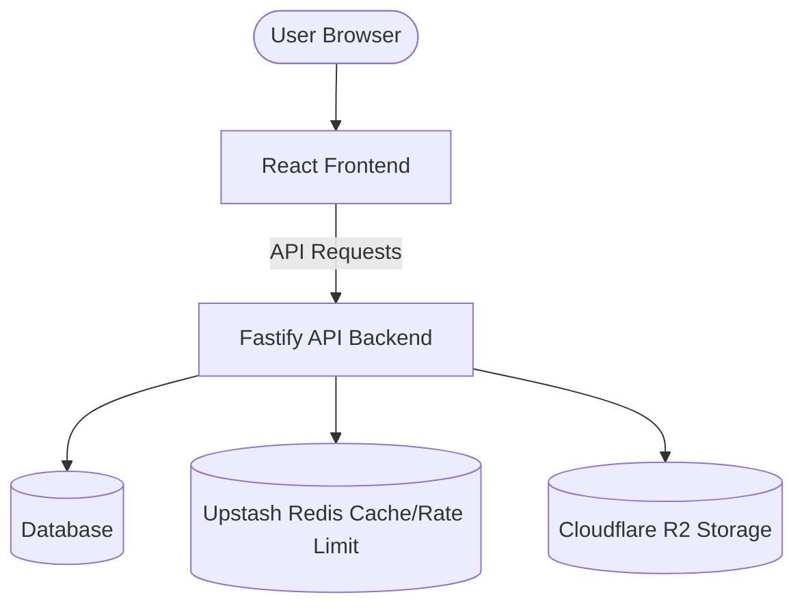

# Nimble Architecture Document

This document describes the high-level architecture of the **Nimble** application.

## Overview

Nimble is designed as a monorepo containing a frontend and a backend package:

1. **Frontend**: React application built with TypeScript and Vite.
2. **Backend**: Fastify REST API server built with Node.js and TypeScript.

## Tech Stack & Core Services

- **Authentication**: Clerk (Frontend & Backend integration)
- **Database**: PostgreSQL (accessible via `DATABASE_URL`)
- **Storage**: Cloudflare R2 Object Storage (used for media and asset storage)
- **Caching & Rate Limiting**: Upstash Redis
- **Hosting / Deployments**: Vercel (Frontend), Node.js server environment (Backend)
